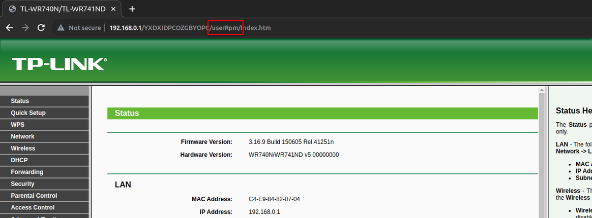
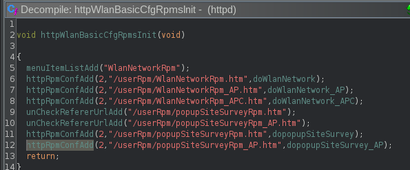
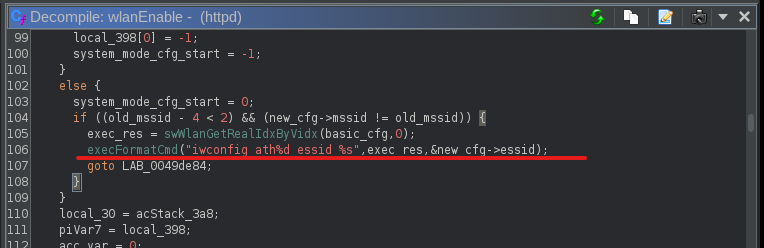
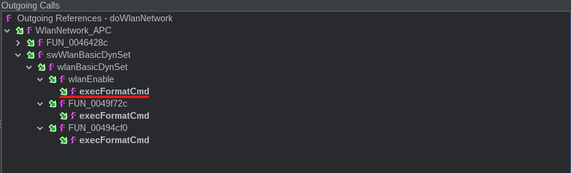
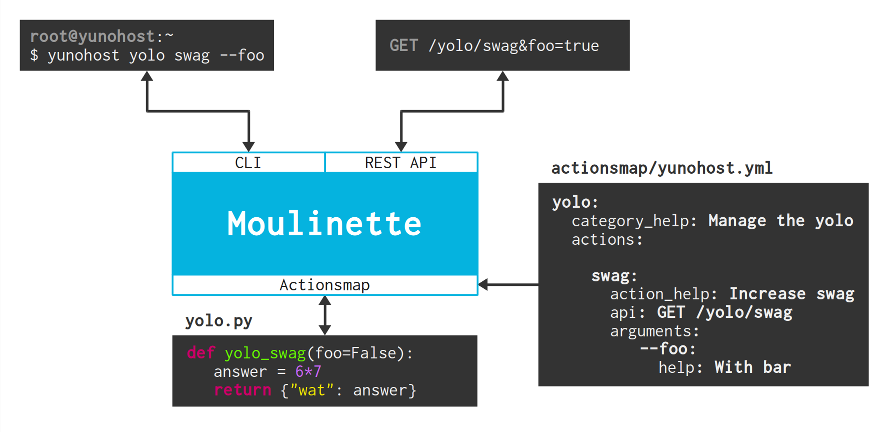
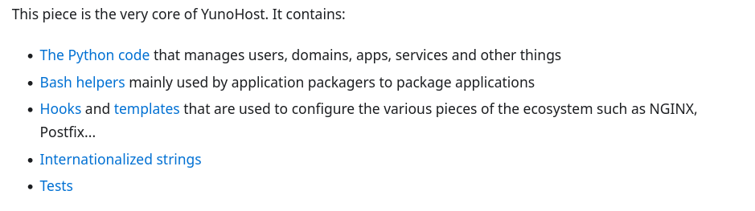
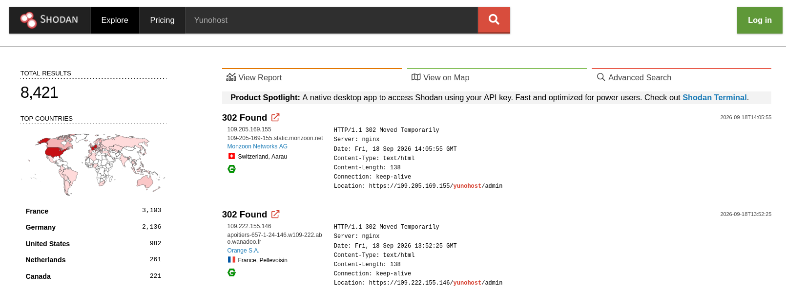
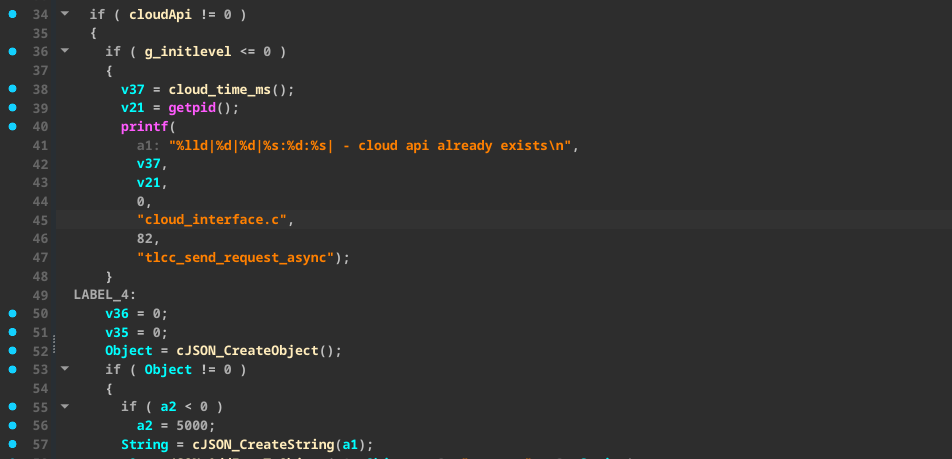
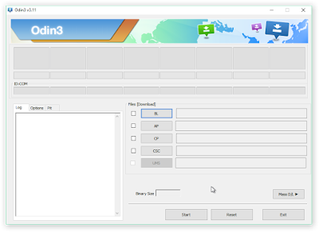

## TL-WR741ND Router
### `RCE`


---

### Target választás

- TP-Link WR741ND
- EOL (Elég régi, már akkor)
- Éveket nem volt használva
- Olcsó (~3k JMF), gagyi
- Publikus, *nem* encrypted FW

---

### Target megismerése

- Firmware vizsgálat
- Webes felület nézegetése
- Reverse engineering

---v

### Firmware vizsgálat

Firmware "kibontása" (`binwalk` / `unblob`), majd az `init` folyamat vizsgálata

```bash
➜ cat etc/inittab
::sysinit:/etc/rc.d/rcS
::respawn:/sbin/getty ttyS0 115200
::shutdown:/bin/umount -a

➜ cat etc/rc.d/rcS
#!/bin/sh
# This script runs when init it run during the boot process.
# Mounts everything in the fstab
...
/usr/bin/httpd &
...
```

---v

### Webes felület vizsgálata

"beszédes" végpont nevek, meylekre rá lehet kereseni a binárisban



---

### Reverse engineering

A `string` parancs kimenetében megkerestem ami érdekelt

```bash
➜ strings httpd | grep '/userRpm/'

/userRpm/DMZRpm.htm
/userRpm/UpnpCfgRpm.htm
/userRpm/AccessCtrlAccessRulesRpm.htm
/userRpm/AccessCtrlAccessRuleModifyRpm.htm
/userRpm/AccessCtrlAccessRulesAdvRpm.htm
...
```

---v

### Reverse engineering

Cross ref-ek alapján megnéztem ezek hogy vannak használva



---v

### Reverse engineering

Ghidra script:
- Összegyűjti a végpontokat
- Kattintható label a handler-ekre

```python
from ghidra.program.flatapi import FlatProgramAPI
from ghidra.app.decompiler import DecompInterface
from ghidra.util.task import ConsoleTaskMonitor

import collections

NAME_PATTERN = "ConfAdd"

# Contains the name of functions and which parameters are interesting for us
FUNC_TYPES = {
    "httpAliasConfAdd": [0, 1],
    "httpPwdConfAdd": [0],
    "httpCtrlConfAdd": [0, 1, 2],
    "httpFsConfAdd": [0, 1],
    "httpUploadConfAdd": [0, 1],
    "httpRpmConfAdd": [0],
}

def getString(addr):
	mem = currentProgram.getMemory()
	core_name_str = ""
	while True:
		byte = mem.getByte(addr.add(len(core_name_str)))
		if byte == 0:
			return core_name_str
		core_name_str += chr(byte)

def find_functions_by_name(fm):
    functions = []
    funcs = fm.getFunctions(True) # True means 'forward'
    for func in funcs:
        name =  func.getName()
        if NAME_PATTERN in name:
            if name != "httpSysRpmConfAdd" and name != 'httpMimeParseFnConfAdd':
                functions.append(func)
    return functions

def check_xrefs(func, address):
    for ref in getReferencesTo(func.getEntryPoint()):
        if ref.getFromAddress() == address:
            return True
    return False

# This is honestly a bit hacky, I'd probably need to look at this more
def get_call_args(func, decompiled_caller, caller):
    high_func = decompiled_caller.getHighFunction()
    opiter = high_func.getPcodeOps()
    ops = collections.deque([], 5)
    res = []
    called = 0
    while opiter.hasNext():
        op = opiter.next()
        mnemonic = str(op.getMnemonic())
        if "COPY" in mnemonic:
            ops.appendleft(op)
        elif "CAST" in mnemonic:
            called = op.getInput(0).getAddress()
        elif "CALL" in mnemonic:
            if called != 0:
                if type(called) == int:
                    called = func.getEntryPoint().getAddress(str(called)).getAddress()
                if check_xrefs(func, called):
                    for idx in FUNC_TYPES[func.getName()]:
                        val = toAddr(ops[idx].getInput(0).getOffset())
                        print "\t\t" + getString(val) + " - ",
                    print(" ")
    return res
                                                


def main():
    monitor = ConsoleTaskMonitor()
    program = getCurrentProgram()
    fm = program.getFunctionManager()
    di = DecompInterface()
    di.openProgram(program)

    functions = find_functions_by_name(fm)
    for func in functions:
        print("{} >> ".format(func.getName()))
        callers = func.getCallingFunctions(monitor)
        for caller in callers:
            print("\t{} >>".format(caller.getName()))
            decomp_caller = di.decompileFunction(caller, 100, monitor)
            args = get_call_args(func, decomp_caller, caller)

main()
```

---v

### Reverse engineering

Egyesével végignéztem a handler-eket és bumm



> ~3 nap munka

---v

### Reverse engineering

Alternatíva: az `execFormatCmd` alapján bejárni a hívási láncokat



---

### Összefoglaló

<div class="mermaid">
  <pre>
    flowchart LR
      A[Attacker]
      subgraph Router
          B[Web Interface]
          subgraph httpd
            C[Handler1]
            D[WlanEnable]
            E[...]
          end
      end
      A --> B
      B --> D
      D --Shell--> A
  </pre>
</div>

---

### Tanulságok

- Ghidra használat
- Reversing flow gyakorlás (feedback miatt)
- Validáció gyors teszttel (PoC helyett)
- Ghidra scripting

---

## YUNoHost
###  `Fail (???)`

---

### Target választás

- Régen a home infra alapja
- Open source
- Pythonban :)
- Egyszer sikerült megölni

---

### Target megismerése

- Dokumentáció (elég jó!)
- Kódvizsgálat (0-ik kör)
- Local instance (debugger miatt)

---

### Dokumentáció

- Moulinette - Actionmap server (API)
- Yunohost - Users, services, etc
- SSOwat - SSO
- Yunohost-portal - Web interface

> https://doc.yunohost.org/en/dev/core/architecture

---v

### Moulinette



---v

### Yunohost



---v

### Overview

<div class="mermaid">
  <pre>
    flowchart TB
        subgraph YUNoHost
            direction BT
            subgraph SSO
                direction LR
                SSOwat
            end
            subgraph WEB/API
                direction LR
                Yunohost-portal --> Moulinette
            end
            subgraph Core
                direction LR
                Yunohost
            end
        end
        Core --> SSO
        Core --> WEB/API
        SSO --> WEB/API  
  </pre>
</div>

---

### Kódvizsgálat

A [yunohost](https://github.com/YunoHost/yunohost) repo `__init__.py` fájlból:

```python
def api(debug, host, port, actionsmap):
  ...
  actionsmap = actionsmap or "share/yunohost/actionsmap.yml"
  ...
  # FIXME : someday, maybe find a way to disable 
  # route /postinstall if postinstall already done ...
  ret = moulinette.api(
      host=host,
      port=port,
      actionsmap=actionsmap,
      ...
  )
```

---v

### Kódvizsgálat

A [moulinette](https://github.com/YunoHost/moulinette) repo `api.py` fájlból:

```python [ | 4,10,11,13]
class Interface:
  ...
  def __init__(self, routes, actionsmap, origins, umask):
    actionsmap = ActionsMap(actionsmap,ActionsMapParser())
    ...
    app = Bottle(autojson=True)
    ...
    # Install plugins
    ...
    actionsmapplugin = _ActionsMapPlugin(actionsmap)
    app.install(actionsmapplugin)
    ...
    self.authenticate = actionsmapplugin.authenticate
    ...
```

---v

### Kódvizsgálat

```python
class _ActionsMapPlugin:
  ...
  def setup(self, app):
    ...
    app.route("/login", name="login",
        method="POST", callback=self.login, 
        skip=[filter_csrf, "actionsmap"],
    )
    ...
    # Append routes from the actions map
    for m, p in self.actionsmap.parser.routes:
        app.route(p, method=m, callback=self.process)
```

---v

### Kódvizsgálat

```python
def login(self):
  params = request.params
  ...
  else:
    if "credentials" in params:
      ...
    elif "username" in params and "password" in params:
        ...
    profile = params.get("profile", ...)
  ...
  authenticator = self.actionsmap.get_authenticator(profile)
  ...
```

---v

### Kódvizsgálat

```python
def get_authenticator(self, auth_method):
  if auth_method == "default":
      auth_method = self.default_authentication
  ...
  mod = f"{self.namespace}.authenticators.{auth_method}"
  ...
  try:
    mod = import_module(mod)
```

---v

### Kódvizsgálat

```python
def import_module(name, package=None):

  level = 0
  if name.startswith('.'):
    if not package:
      raise TypeError("...")
    for character in name:
      if character != '.':
        break
      level += 1

  return _bootstrap._gcd_import(name[level:], package, level)
```

---

### Összefoglaló

- Modul `import` primitív (?)
- Önmagában semmire se jó
- Kéne egy `write` primitív!
- `RCE` (?)

---

### Tanulságok

- Rengeteget segített a local instance!
- `breakpoint` többszálas python programban
- Később visszamenni korábbi "találatokhoz"

> `TODO` - Videót berakni ide!

---

### Shodan



---

## TL-Archer AX23 Router
### `Fail (?)`

---

### Target választás

- A kamrában találtam :)
- Elég drága (~30k JMF)
- Nem EOL!
- Publikus, *nem* encrypted FW

---

### Target választás

Végül nem is a router lett a fő célpont


---

### Target megismerése

- Firmware vizsgálat
- Alkalmazása beállítása
- Reverse engineering
- Firmware vizsgálat

---

### Firmware vizsgálat

Van [letölthető](https://www.tp-link.com/us/support/download/archer-ax23/#Firmware) firmware!

```bash
➜ tree -L 3 extractions/
extractions/
├── ax23.bin
└── ax23.bin.extracted
    ├── 2014
    │   └── Linux_Kernel_Image.bin
    └── 2F65C2
        └── squashfs-root
```

A `binwalk` szépen kibontja

---v

### Firmware vizsgálat

`OpenWRT` alapú!

```bash
➜ cat etc/openwrt_version
12.09-rc1
```

---v

### Firmware vizsgálat

Az `init` is egészen egyszerű:

```bash
➜ cat etc/init.d/rcS
...
run_scripts() {
  for i in /etc/rc.d/$1*; do
    ...
  done | $LOGGER
}
...
if [ "$1" = "S" -a "$foreground" != "1" ]; then
	run_scripts "$1" "$2" &
...
```

---v

### Firmware vizsgálat

```bash
➜ ls etc/rc.d/ | wc -l
99

➜ ls etc/rc.d/ | rg cloud
K60cloud_brd
S98cloud_brd
S99cloud_client
S99cloud_https
```

---v

### Firmware vizsgálat

A `cloud_client` szépen értelmezhető!



---

### Alkalmazás beállítása

- Emulátorban nem működött
- Root-olni kellett a telómat
- SSH port-forward a pentest gépre

---v

### Alkalmazás beállítása

Samsung telefonokhoz [odin](https://xdaforums.com/t/rooting-a-samsung-device-using-magisk-and-odin-2026-updated.4594475/). Linux alatt Windows VM-ben is *működött*! (USB forward)



**NE** próbálkozzunk Xiaomi telefonnal ...

---v

### Alkalmazás beállítása

<div class="mermaid">
  <pre>
    flowchart TB
    subgraph HomeLAN
        A[Phone]
        B[Laptop]
    end
    subgraph WorkInfra
        D[Burp]
    end
    A --Proxy--> B
    HomeLAN --VPN-->Internet
    Internet --VPN-->WorkInfra
    HomeLAN --SSHForward--> WorkInfra 
  </pre>
</div>

---

### Reverse engineering

- Nulla dokumentáció :( <!-- .element: class="fragment" data-fragment-index="1" -->
- Heteket töltöttem vele!! <!-- .element: class="fragment" data-fragment-index="2" -->

---v

### Reverse engineering

Tényleg sok meló ment bele <!-- .element: class="fragment" data-fragment-index="1" -->

 <!-- .element: class="fragment" data-fragment-index="2" -->

---

### Összefolglaló

- Az eszköz meghalt (RIP)
- Nem vettem újat ...

---

### Tanulságok

- A tanult skillek hasznosak máshol!
- Telefon rooting, SSH forwarding, stb

---

## Frappe
### `Fail`

---

### Target választás

- Csúfos fail után valami barátibb
- Láttam, hogy sok a CMS vuln
- "Na MaJd Én Is SzÍjJeLhAcKoLoM"
- Több célpont közül válaszottam (open source)
- Frappe (python, értelmezhető kód)

---

### Target megismerése

- Repo klónozása
- Az `init` logika értelmezése
- "Alkalmazás" koncepció vizsgálata
- Végpont definíciók azonosítása

---v

### Init logika

Az `__init__.py` fájlból:

```python
def init(...):
  ...
  setup_module_map(include_all_apps=not 
            (is_request or is_job or frappe.flags.in_migrate))
  ...
```

---v

### Init logika

Az `__init__.py` fájlból:

```python
def setup_module_map(include_all_apps: bool = True) -> None:
  ...
  if not app_modules:
    app_modules = {}
    ...
    if include_all_apps:
      apps = get_all_apps(with_internal_apps=True)
    else:
      apps = get_installed_apps(_ensure_on_bench=True)
    ...
```

---v

### Init logika

```python
def get_all_apps(with_internal_apps=True, sites_path=None):
  ...
  apps = get_file_items(os.path.join(sites_path, "apps.txt"), raise_not_found=True)
  ...
  return apps
```

---v

### Alkalmazás koncepció

A [dokumentáció](https://docs.frappe.io/framework/user/en/basics/apps) alapján:

- A Frappe app is a *python package* that uses the Frappe framework. 
- Frappe apps live in a directory called `apps` in ... 
- A Frappe app should have an entry in `apps.txt`.

---v

### Alkalmazás koncepció

- Az alkalmazások egyediek
- Egyetlen alkalmazás van, amely minden Frappe instance része. A `Frappe`!

---

### Végpont definíciók

Az `app.py` fájlból:

```python
def serve(port=8000, ...):
  global application, _site, _sites_path
  ...
  run_simple(
    bind_addr or os.environ.get("FRAPPE_BIND_ADDR") ...,
    int(port),
    application,
    ...
  )
```

---v

### Végpont definíciók

Az `app.py` fájlból:

```python
@Request.application
def application(request: Request):
  ...
  try:
    init_request(request)
    validate_auth()
    ...
    elif request.path.startswith("/api/"):
      response = frappe.api.handle(request)
    ...
```

---v

### Végpont definíciók

Az `api/__init__.py` fájlból:

```python
def handle(request: Request):
  ...
  try:
    endpoint, arguments = API_URL_MAP.bind_to_environ(request.environ).match()
  ...
```

*Centralizált implementáció!*

---v

### Végpont definíciók

Az `api/v2.py` fájlból:

```python
url_rules = [
  ...
  Rule("/discovery", methods=["GET"], endpoint=discovery.root),
  Rule("/discovery/search", methods=["GET"],
    endpoint=lambda: discovery.search(frappe.form_dict.get("q")),
  ),
  Rule("/discovery/method", methods=["GET"], endpoint=discovery.methods),
  ...
```

---

### Összefoglaló

- Centralizált mechanizmusok
- Jól meggondolt megoldások
- Rengeteg idő (~3hét / 1hónap)
- Feladtam ...

---

### Tanulságok

- Több célpont esetén az ismertebbet támadni
- Meg kell tanulni feladni ...
- Nem kötelező tovább folytatni!

---


---

## Micropie
### `FAIL(?)`


---

### Target választás

- Már megszállottam kerestem őket ...
- Véletlen szembejött velem
- Python
- Single-file framework

---

### Target megismerése

- Fájl megnyitása github-on
- Olvasás ...

---

### Végpontok

```python [ | 10-11]
class App:
  ...
  async def _asgi_app_http(...):
    ...
    # Routing
    path: str = scope["path"].lstrip("/")
    parts: List[str] = path.split("/") if path else []
    if hasattr(request, "_route_handler"):
      func_name: str = request._route_handler
    else:
      func_name: str = parts[0] if parts else "index"
      if func_name.startswith("_") or func_name.startswith("ws_"):
        await _early_exit(404, "404 Not Found")
          return
    ...
```

---v

### Végpontok

```python [ | 5, 9]
...
if not request.path_params:
    request.path_params = parts[1:] if len(parts) > 1 else []

... = self._resolve_route_handler(func_name)
index_handler, _ = self._resolve_route_handler("index")
...
# Execute handler
try:
    result = ( await handler(*func_args, **func_kwargs)
    ...
```

---

### Összefoglaló

- Blocklist
- Nem találtam bypass módszert
- De szerintem nem lehetetlen!
- Impact?

---

### Tanulságok

- Időről időre erre is vissza kéne nézni (?)
- Kicsit projekt, nagy fun! :)

---

## Directus
### `File write`

---

### Target választás

- Munkahelyi projekt
- Open source / Javascript
- 38k+ github star

---

### Target megismerése

- Projekt során nincs account
- Unauth hibák keresése
- Végpontok és service-ek
- Auth bypass keresése

---

### Végpontok / Service-ek

Az `api/src/controllers/files.ts` fájlból:

```js [ | 1,3,9]
router.use(checkIsLocked('files'));
router.get(
	'/:pk',
	...
);
```

URL formátum: `/files/<pk>`

---v

### Végpontok / Service-ek

```js [ | 4-7,9]
router.use(checkIsLocked('files'));
router.get(
	'/:pk',
	asyncHandler(async (req, res, next) => {
		const service = new FilesService({
			accountability: req.accountability,
			schema: req.schema,
		});
		record = await service.readOne(req.params['pk']!,...);
		res.locals['payload'] = { data: record || null };
		return next();
	}),
	respond,
);
```

---v

### Végpontok / Service-ek

<div class="mermaid">
  <pre>
    sequenceDiagram
    Browser->>Directus: Request
    Directus--> EndpointHandler:
    Note over EndpointHandler: Preprocessing
    EndpointHandler->> Service:
    Note over Service: ???
  </pre>
</div>

---

### Auth

```javascript [|2-5]
export type Accountability = {
	role: string | null;
	roles: string[];
	user: string | null;
	admin: boolean;
	app: boolean;
	share?: string;
	ip: string | null;
	userAgent?: string;
	origin?: string;
	session?: string;
};
```

---v

### Auth

```js [|3-4,11-12]
const extractToken: RequestHandler = (req, _res, next) => {
 
  if (req.headers && req.headers.authorization) {
  const parts = req.headers.authorization.split(' ');
  
  if (parts.length === 2 && parts[0]!.lower() === 'bearer') {
	  ...
	  token = parts[1]!;
  }
  ...
  req.token = token;
  next();
 }
```

---v

### Auth

```js [|3-4,7-8]
export const handler = async (req, res, next, ) => {
	...
  const defAcc: Accountability = 
    createDefaultAccountability({ ip: getIPFromReq(req) });
    ...
	try {
		req.accountability = 
      await getAccountabilityForToken(req.token, defAcc);
	} catch (err) {
		...
	}
	return next();
};
```

---v

### Auth

```js
const service = new FilesService({
  accountability: req.accountability,
  schema: req.schema,
});
```

---v

### Auth

1. `Authorization` header
2. `Bearer` token
3. `getAccountabilityForToken(token)`
4. `FileService(accountability)` 

---v

### Auth

<div class="mermaid">
  <pre>
    sequenceDiagram
    Browser ->> Directus:
    Note over Directus: Accountability
    Directus--> EndpointHandler: 
    EndpointHandler->>Service: Instantiate(accountability)
    Note over EndpointHandler: Preprocessing
    EndpointHandler->>Service: Invoke
    Note over Service: Acc. check
  </pre>
</div>

---

### !Auth

`multipart/form-data` -> `File` object

```javascript
router.post(
	'/apply',
	asyncHandler(schemaMultipartHandler),
	asyncHandler(async (req, res, next) => {
		...
	}),
	respond,
);
```

---v

### !Auth

Komplex adatfeldolgozás `Service` hívás előtt!

```javascript [|6,10]
onst schemaMultipartHandler: RequestHandler = (req, res, next) => {
	...
	busboy.on('file', async (_, fileStream, { mimeType }) => {
    ...
    if {...}
      upload = parseJSON(uploadedString);
      ...
    } else {
      ...
      upload = await loadYaml(uploadedString);
  ...
```

---

### Vuln

Keresendő: `asyncHandler\(.*\),`

```javascript
router.patch(
	'/:pk',
	asyncHandler(multipartHandler),
	asyncHandler(async (req, res, next) => {
		const service = new FilesService({
	...
);
```

---v

 
### Vuln

```javascript [|3-4|6-7|9|11|13]
func multipartHandler: RequestHandler = (req, res, next) => {
  ...
  const busboy = Busboy(... )
  let payload: any = {};
  ...
  busboy.on('field', (fieldname, val) => { ...
                                payload[fieldname] = val;
  ...
  busboy.on('file', ...
    ...
    payload.filename_download ||= filename;
    ...
    const primaryKey = await FilesService.uploadOne(...);
  ...
```


---v

<pre class="r-stretch"><code class="language-javascript" data-trim data-line-numbers="|1-4|6-9|12-18|21|22-23">
if (primaryKey) { db_data = ( ... this.knex, 
                        ... where({ id: primaryKey })...
...
const metadata = { ...(db_data ?? {}), ...clone(payload) };
...
const isReplacement = db_data !== null && 
                          primaryKey !== undefined;
if (!isReplacement) { 
          primaryKey = await this.createOne(metadata, ...);}

...
const ext = path.extname(metadata.filename_download!) ...
metadata.filename_disk ||= primaryKey + (fileExtension || '');

if (... path.extname(metadata.filename_disk!) !== ext)
    metadata.filename_disk = primaryKey + (fileExtension || ''); }
...
const tempFilenameDisk = 'temp_' + metadata.filename_disk;

...
try {...disk.write(tempFilenameDisk, stream, metadata.type);...
if (isReplacement === true) 
            { await this.updateOne(primaryKey, metadata );
</code></pre>

---v

### Vuln

<div class="mermaid">
  <pre>
    sequenceDiagram
    Browser ->> Directus:
    Note over Directus: Accountability
    Directus--> EndpointHandler: 
    EndpointHandler->>Service: Instantiate(accountability)
    Note over EndpointHandler: Preprocessing
    EndpointHandler->>Service: Invoke
    rect rgb(255,150,150)
    Note over Service: Vuln
    end
    Note over Service: Acc. check
  </pre>
</div>

---

### Összefoglaló

- "Majdnem" arbitrary file write
- [CVE-2025-55746](https://github.com/directus/directus/security/advisories/GHSA-mv33-9f6j-pfmc) (CVSS 9.8)
- Szikra az utolsó utáni pillanatban
- A korábbi kutatások ide vezettek
